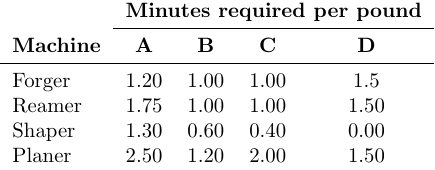

# Introduction

The **Manifacturing INC** (MNC) makes four different metal alloys: A, B, C and D.
The company is barely able to keep up with the increasing demand for these products. However, increasing raw material prices and foreign competition are forcing MNC to watch its margins to ensure it is operating in the most efficient manner possible.

# Marketing Demands

To meet marketing demands for the coming week, MNC needs to produce

- at least 1,200 pounds of the A product,
- between 450 and 650 pounds of the B product,
- no more than 120 pounds of the C product, and
- no more than 150 pounds of D product.


# Production Requirements

Each pound of the A, B, C, and D product contains, respectively, 55%, 45%, 25%, and 100% aluminum made up of copper.

The company has 1300 pounds of aluminum and 900 pounds of copper copper for use in the next week.

The various products are made using four different machines: forger, reamer, shaper, and planer. The following table summarizes the time required by each product on each machine. Each machine has 60 hours of time available in the coming week.



# Financial summary

The controller recently presented management with the following financial summary of MNC's average weekly operations over the past quarter. From this report, the controller is arguing that the company should cease producing its B and C products.


# Questions
a. Do you agree with the controller's recommendation? Why or why not?  

Answer:  
I wouldn't agree with the controller's recommendation. 
-The B product has had a slightly negative net profit, but the market has changed towards a higher need that might turn the net profit to positive. It doesn't look necessary either and has a balanced request for aluminum and copper use. 
-The C product instead has sold at 83% efficiency (with respect to max upcoming requests) and already has a solid net profit so there's no immediate reason to drop it from production.   


b. Formulate an LP model for this problem.  

Answer:  
The decision variables are the pounds of A, B, C, D products to manufacture. 
The objective function to be maximized is the net profit of the production mix (to be found).
The constraints are the machine hours available and the marketing demands, plus the materials available with respect to the alloy combination.
```{r r_setup, include = FALSE}
#LP_SOLVE
if(require(lpSolveAPI)==FALSE) install.packages("lpSolveAPI")
library(lpSolveAPI)
library(tidyr)
library(dplyr)

printSensitivityRHS <- function(model){
  
  options(scipen=999)
  arg.rhs =get.sensitivity.rhs(model)
  numRows <- length(arg.rhs$duals)
  
  symb <- c() 
  for (i in c(1:numRows)) { 
    symb[i] <- paste("B", i, sep = "" ) 
  }
  
  rhs <- data.frame(rhs = symb,arg.rhs)
  
  rhs<-rhs %>%
    mutate(dualsfrom=replace(dualsfrom, dualsfrom < -1000, "-inf")) %>%
    mutate(dualstill=replace(dualstill, dualstill > 10000, "inf")) %>%
    unite(col = "Sensitivity",  
          dualsfrom, rhs, dualstill , 
          sep = " <= ", remove = FALSE) %>%
    select(c("rhs",'duals',"Sensitivity")) #Duals --> shadow price
  
  colnames(rhs)[1]<-c('Rhs')
  print(rhs[1:6,])
}
printSensitivityObj <- function(model){
  options(scipen=999)
  arg.obj = get.sensitivity.obj(model)
  
  numRows <- length(arg.obj$objfrom)
   symb <- c() 
   for (i in c(1:numRows)) { 
     symb[i] <- paste("C", i, sep = "" ) 
   }
   
  obj <- data.frame(Objs = symb, arg.obj)
  
  obj<-
    obj %>%
    mutate(objfrom=replace(objfrom, objfrom < -1000, "-inf")) %>%
    mutate(objtill=replace(objtill, objtill > 1000, "inf")) %>%
    unite(col = "Sensitivity",  
          objfrom, Objs, objtill , 
          sep = " <= ", remove = FALSE) %>%
    select(c("Objs","Sensitivity"))
    print(obj)
}
```

```{r}
#machine time (in mins) needed per pound of product
timeA = c(1.2,1.75,1.3,2.5)
timeB = c(1,1,0.6,1.2)
timeC = c(1,1,0.4,2)
timeD = c(1.5,1.5,0,1.5)

#marketing demands as pound needed
lowerA = 1200
lowerB = 450
upperB = 650
upperC = 120
upperD = 150

#variable costs per pound (as variable costs / pounds sold in the table)
varcostA = 3200/1200
varcostB = 1550/400
varcostC = 300/100
varcostD = 350/250

#fixed costs per product
fixcostA = 600
fixcostB = 500
fixcostC = 250
fixcostD = 300

#compounds available (in pounds)
aluminumTOT = 1300
copperTOT = 900

#alloy mix (as fraction of aluminum, the percentage of copper being (100%-aluminum%))
mixA = 0.55
mixB = 0.45
mixC = 0.25
mixD = 1

#sales revenue per pound of product
revenueA = 5769/1200
revenueB = 2000/400
revenueC = 700/100
revenueD = 879/250

#net profit of each product, given A, B, C, D pounds of respective products
# profitA = A*(revenueA-varcostA)-fixcostA
# profitB = B*(revenueB-varcostB)-fixcostB
# profitC = C*(revenueC-varcostC)-fixcostC
# profitD = D*(revenueD-varcostD)-fixcostD
#fixed costs can be excluded depending on the context model

#objective function (it's a general model, fixed costs can be included or not,
#depending on the profits definitions, by means of binary variables)
#maximize f(A, B, C, D) = profitA+profitB+profitC+profitD
#s.t. 
#     A*mixA+B*mixB+C*mixC+D*mixD <= aluminumTOT
#     A*(1-mixA)+B*(1-mixB)+C*(1-mixC) <= copperTOT
#     timeForger=A*timeA[1]+B*timeB[1]+C*timeC[1]+D*timeD[1]<= 3600
#     ...
#     A >= lowerA
#     B >= lowerB
#     B <= upperB
#     C <= upperC
#     D <= upperD
#     C, D >= 0


```
  

c. Create a executable model in R for this problem and solve it.  

Answer:  
A first, simplistic model would be one with no regards for fixed costs
```{r}

coeff_profitA = (revenueA-varcostA)
coeff_profitB = (revenueB-varcostB)
coeff_profitC = (revenueC-varcostC)
coeff_profitD = (revenueD-varcostD)

modelNOFX = make.lp(0,4)                # 0 starting constraints, 4 variables
#lp.control(modelNOFX, sense="max")      # original maximization problem, hidden for clarity
```
```{r, include = FALSE}
lp.control(modelNOFX, sense="max")      # original maximization problem, hidden for clarity
```
```{r}
set.objfn(modelNOFX,obj=c(coeff_profitA,coeff_profitB,coeff_profitC,coeff_profitD))

row.add.mode(modelNOFX, "on");
add.constraint(modelNOFX,
               xt=c(timeA[1], timeB[1], timeC[1], timeD[1]),
               type="<=",rhs=3600,
               indices=c(1:4))   # Constraint 1.1 on Forger Machine Time
add.constraint(modelNOFX,
               xt=c(timeA[2], timeB[2], timeC[2], timeD[2]),
               type="<=",rhs=3600,
               indices=c(1:4))   # Constraint 1.2 on Reamer Machine Time
add.constraint(modelNOFX,
               xt=c(timeA[3], timeB[3], timeC[3], timeD[3]),
               type="<=",rhs=3600,
               indices=c(1:4))   # Constraint 1.3 on Shaper Machine Time
add.constraint(modelNOFX,
               xt=c(timeA[4], timeB[4], timeC[4], timeD[4]),
               type="<=",rhs=3600,
               indices=c(1:4))   # Constraint 1.4 on Planer Machine Time
add.constraint(modelNOFX,
               xt=c(mixA, mixB, mixC, mixD),
               type="<=",rhs=aluminumTOT,
               indices=c(1:4))   # Constraint 2.1 on Aluminum availability
add.constraint(modelNOFX,
               xt=c(1-mixA, 1-mixB, 1-mixC),
               type="<=",rhs=copperTOT,
               indices=c(1:3))   # Constraint 2.2 on Copper availability
row.add.mode(modelNOFX, "off");
set.bounds(modelNOFX,lower=c(lowerA,lowerB,0,0), upper=c(2000,upperB,upperC,upperD))

modelNOFX

solve(modelNOFX)
```

A more nuanced model would require binary variables to account for fixed costs    
```{r}
modelFC = make.lp(0,8)
```
```{r, include = FALSE}
lp.control(modelFC, sense="max")      #maximization problem, hidden for clarity
```
```{r}
set.objfn(modelFC,obj=c(coeff_profitA,coeff_profitB,coeff_profitC,coeff_profitD, -fixcostA, -fixcostB, -fixcostC, -fixcostD))
set.type(modelFC, 5:8, "binary")

row.add.mode(modelFC, "on")
add.constraint(modelFC,
               xt=c(timeA[1], timeB[1], timeC[1], timeD[1]),
               type="<=",rhs=3600,
               indices=c(1:4))   # Constraint 1.1 on Forger Machine Time
add.constraint(modelFC,
               xt=c(timeA[2], timeB[2], timeC[2], timeD[2]),
               type="<=",rhs=3600,
               indices=c(1:4))   # Constraint 1.2 on Reamer Machine Time
add.constraint(modelFC,
               xt=c(timeA[3], timeB[3], timeC[3], timeD[3]),
               type="<=",rhs=3600,
               indices=c(1:4))   # Constraint 1.3 on Shaper Machine Time
add.constraint(modelFC,
               xt=c(timeA[4], timeB[4], timeC[4], timeD[4]),
               type="<=",rhs=3600,
               indices=c(1:4))   # Constraint 1.4 on Planer Machine Time
add.constraint(modelFC,
               xt=c(mixA, mixB, mixC, mixD),
               type="<=",rhs=aluminumTOT,
               indices=c(1:4))   # Constraint 2.1 on Aluminum availability
add.constraint(modelFC,
               xt=c(1-mixA, 1-mixB, 1-mixC),
               type="<=",rhs=copperTOT,
               indices=c(1:3))   # Constraint 2.2 on Copper availability
add.constraint(modelFC, 
               xt=c(1, -2000),  # Reasonable upper bound for A, e.g. if all copper gets involved for it
               type="<=",rhs=0,
               indices=c(1,5))  # Constraint linking X1 (A) and Y1 (A's fixed cost)
add.constraint(modelFC, 
               xt=c(1, -upperB),  # Reasonable upper bound for B as stated
               type="<=",rhs=0,
               indices=c(2,6))  # Constraint linking X2 (B) and Y2 (B's fixed cost)
add.constraint(modelFC, 
               xt=c(1, -upperC),  # Reasonable upper bound for C as stated
               type="<=",rhs=0,
               indices=c(3,7))  # Constraint linking X3 (C) and Y3 (C's fixed cost)
add.constraint(modelFC, 
               xt=c(1, -upperD),  # Reasonable upper bound for D as stated
               type="<=",rhs=0,
               indices=c(4,8))  # Constraint linking X4 (D) and Y4 (D's fixed cost)
row.add.mode(modelFC, "off");
set.bounds(modelFC,lower=c(lowerA,lowerB,0,0,0,0,0,0),upper=c(2000,upperB,upperC,upperD,1,1,1,1))

modelFC

solve(modelFC)
```

d. What is the optimal solution?  
Answer:  
For the simplistic model
```{r}
get.variables(modelNOFX)
```
Those are the pounds for products A, B, C, D respectively.

For the nuanced model
```{r}
get.variables(modelFC)
```
Those are the pounds of products A, B, with non-negative linked values for the decision to produce them and meeting the associated fixed costs.  


e. Perform the sensitivity analysis for this solution and answer the following questions.
Answer:
As explicitly requested in the latest announcement, the following analysis (for questions e-l) doesn't account for fixed costs. The very net profits can be found simply subtracting the sum of the fixcostX variables, which is generally irrelevant. Nonetheless, the difference with analysis that use the modelFC to implement fixed costs may be very different. 
```{r}
get.constraints(modelNOFX) # to see how far we are from the fulfillment of the constraints
get.primal.solution(modelNOFX) #information in the form 
#[obj_value, constraints, decision_variables]
get.basis(lprec = modelNOFX, nonbasic = FALSE)  # gets the optimal basis 
#[-indexes of the list of slack and actual variables]
#[s1,s2,s3,s4,s5,s6,c1,c2,c3,c4]
get.dual.solution(modelNOFX) #first element 1 by default, then shadow prices of dual variables and dual slack variables

get.sensitivity.rhs(modelNOFX)
get.sensitivity.obj(modelNOFX)

printSensitivityObj(modelNOFX)
#the objective-function stability intervals for any single change of the coefficients


printSensitivityRHS(modelNOFX)
#the objective-function stability intervals for any single change of the constraining values
```
  

f. Is the solution degenerate?  
Answer:  
The solution is not degenerate, and the solver confirms it by the coded result of "0" for function solve(). To be degenerate, the solution  would have to allow 0 Increase/Decrease on any constraint. The basic variables for the basic feasible solution don't take the value of 0.  

g. Is the solution unique?  
Answer:  
The solution is unique, since the constraints are linear and underlie a convex polytope where either a vertex or a whole edge is the basis of a solution. Given the simplex convergence, there are not other solutions.  

h. If MNC wanted to decrease the production on any product, which one would you recommend and why?  
Answer:  
The most profitable or less costly decrease of production depends on the reduced cost of any given product.
Since the solution from the LP solver is optimal, any change without context would result in economic damage.
For example, product B has the lowest net profit per pound, if fixed costs are not accounted for, but it's still positive.
```{r}
revenueB-varcostB
```
The important constraint, that underlies both the manufacturing combination and the profit, is the Planer machine time available, already saturated. An increase would locally increase profits for the same combination, and generally change the optimal combination.
So the prescription is to follow the optimal solution if possible, while the best decrease given the past quarter situation would indeed be decreasing B production, considering the optimal solution works assuming the predicted market demands would be saturated  


i. If MNC wanted to increase the production of any product, which one would you recommend and why?  
Answer:  
Previous considerations still standing, C has the best net profit per pound (if fixed costs are not accounted for) and it'd be promising to increase its production if machine time were increased or other products were decreased by choice, given the optimal solution is way below the forecast market demands   


j. Which resources are preventing MNS from making more money? If they could acquire more of this resource how much should they acquire & how much should they be willing to pay to acquire it?  
Answer:  
As stated above, the saturated constraint is the Planer machine time available. Any unit [1 minute] increase corresponds to an increase of 2 in the objective function, which counts the monetary value of the net profits, until its sensistivity upper bound (3780).
After that, the problem should be completely modeled from the beginning. Until that, as implicit in the "shadow price" definition, the company should be willing to pay any price lesser than 2/min.  


k. How much should MNC be willing to pay to acquire more copper?  
Answer:  
The get.constraints() function showed that the optimal solution requires 810 pounds of copper, which is 90% of the available resource. Unless the the Planar machine times changes drastically, there's no use for a different combination of production and hence copper needs. MNC can avoid any copper offer, or base them on considerations out of the scope of the present analysis  


l. If the marketing department wanted to decrease the price of the A product by $0.25, would the optimal solution change?  
Answer:  
The sensitivity analysis synthesized by the printSensitivityObj() function showed no lower bound for product A's coefficient, meaning the optimal solution for the pounds to be produced will not change; this doesn't mean the value of the objective function would not.
Let's verify it by reframing the model:
```{r}
coeff_profitA=coeff_profitA-0.25
model = make.lp(0,4)                # 0 starting constraints, 4 variables
#model stated as above, hidden for clarity
```
```{r, include = FALSE}
lp.control(model, sense="max");      # original maximization problem


set.objfn(model,obj=c(coeff_profitA,coeff_profitB,coeff_profitC,coeff_profitD))

row.add.mode(model, "on");
add.constraint(model,
               xt=c(timeA[1], timeB[1], timeC[1], timeD[1]),
               type="<=",rhs=3600,
               indices=c(1:4))   # Constraint 1.1 on Forger Machine Time
add.constraint(model,
               xt=c(timeA[2], timeB[2], timeC[2], timeD[2]),
               type="<=",rhs=3600,
               indices=c(1:4))   # Constraint 1.2 on Reamer Machine Time
add.constraint(model,
               xt=c(timeA[3], timeB[3], timeC[3], timeD[3]),
               type="<=",rhs=3600,
               indices=c(1:4))   # Constraint 1.3 on Shaper Machine Time
add.constraint(model,
               xt=c(timeA[4], timeB[4], timeC[4], timeD[4]),
               type="<=",rhs=3600,
               indices=c(1:4))   # Constraint 1.4 on Planer Machine Time
add.constraint(model,
               xt=c(mixA, mixB, mixC, mixD),
               type="<=",rhs=aluminumTOT,
               indices=c(1:4))   # Constraint 2.1 on Aluminum availability
add.constraint(model,
               xt=c(1-mixA, 1-mixB, 1-mixC),
               type="<=",rhs=copperTOT,
               indices=c(1:3))   # Constraint 2.2 on Copper availability
row.add.mode(model, "off");
set.bounds(model,lower=c(lowerA,lowerB,0,0), upper=c(2000,upperB,upperC,upperD))
```
```{r}
model

solve(model)
get.variables(model)
get.variables(modelNOFX)
get.objective(model)
get.objective(modelNOFX)
```
As expected, the optimal combination doesn't change, while its monetary return does.